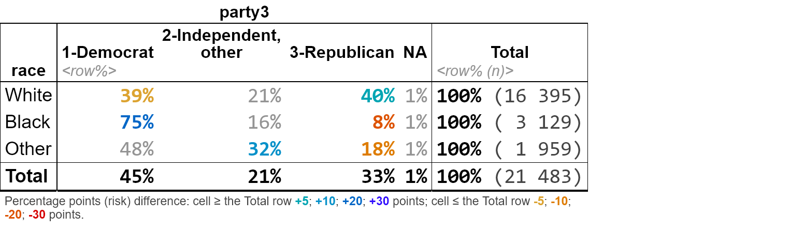
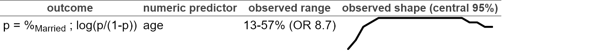
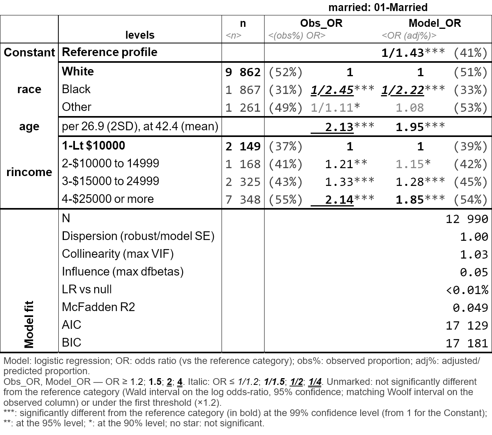

<!-- README.md is generated from README.Rmd. Please edit that file -->

# tabxplor

<!-- badges: start -->

[](https://CRAN.R-project.org/package=tabxplor)
[](https://github.com/BriceNocenti/tabxplor/actions/workflows/R-CMD-check.yaml)
[](https://app.codecov.io/gh/BriceNocenti/tabxplor)
<!-- badges: end -->

`tabxplor` makes cross-tables and regression models readable at a glance
for data exploration. It builds a table with percentages, weighted
counts, confidence intervals, tests — and colors highlight the cells
that stand out from the total or reference, only when the difference is
statistically solid, to spot the structure of your data immediately.

- **Colors encode effect size and significance**: the stronger the
  difference, the deeper the color; non-significant cells are
  greyed-out.
- Html, Excel and markdown/Quarto exports are available.
- It comes with a point-and-click [jamovi](https://www.jamovi.org/)
  graphical interface: no code needed.
- A black-and-white `theme = "print_ready"` renders the same reading for
  journals.
- **Regression models** are presented with the same visual language,
  next to their observed effect.
- In R the tables **are `tibble`s you can keep working on with
  `dplyr`**. Cells are rich values, each one carries its count,
  percentage, confidence interval and reference behind the displayed
  number.
- Weighted data and survey design are supported.

*The tables below are screenshots of the [package
website](https://bricenocenti.github.io/tabxplor/), where they are live
html: GitHub strips the colors out of a README. Above each one is the
code that built it.*

## Installation

``` r
install.packages("tabxplor", dependencies = TRUE)

# Development version:
# install.packages("devtools")
devtools::install_github("BriceNocenti/tabxplor")
```

## A quick look

A simple cross-table with row percentages: shades of blue mean the cell
is over-represented compared to the total row, shades of yellow to red
mean it is under-represented.

``` r
gss <- gss_cat_data_formatting() # a cleaned-up version of forcats::gss_cat

tab(gss, race, party3, pct = "row", color = "difference")
```



Several column variables can be crossed at once for series of Yes/No
survey questions. With `color_signif = "grey_non_signif"`, cells that
are not significantly different from the total are greyed out, so every
colored figure is a solid one. Use `wt =` for weighted or survey data.
Example with [FactoMineR](http://factominer.free.fr/index_fr.html) tea
data :

``` r
tea_when_vars <- c("breakfast", "tea.time", "evening", "lunch", "dinner", "always")
tab(facto_tea, SPC, all_of(tea_when_vars), pct = "row", 
    levels = "first", na = "drop", 
    color = "difference", ref = "first", color_signif = "grey_non_signif")
```


The same visual language extends to regression models: `tab_reg()`
detects a binary outcome and fits a logistic regression, coloring odds
ratios by strength and greying the non-significant ones, with a default
comparison between the modelised deviations and their crude/observed
counterparts.

``` r
tab_reg(gss, outcome = "married", predictors = c("race", "age", "rincome"))
```




Or as a black and white table ready for publication:

``` r
options(tabxplor.theme = "print_ready")
tab_reg(gss, outcome = "married", predictors = c("race", "age", "rincome"))
```



## Export your tables

Any table exports with its colors to Excel, html or markdown (for Word,
copy-paste from Excel) :

``` r
tab(gss, marital, race, pct = "row", color = "difference") |> tab_html()
tab(gss, marital, race, pct = "row", color = "difference") |> tab_xl()
tab(gss, marital, race, pct = "row", color = "difference") |> tab_xl(theme = "print_ready")
```

## Learn more

- [Introduction to
  tabxplor](https://bricenocenti.github.io/tabxplor/articles/tabxplor.html)
  — the place to start (*aussi disponible [en
  français](https://bricenocenti.github.io/tabxplor/articles/tabxplor-fr.html)*).
- [Regression tables with
  tab_reg()](https://bricenocenti.github.io/tabxplor/articles/tabxplor-reg.html)
  (*aussi disponible [en
  français](https://bricenocenti.github.io/tabxplor/articles/tabxplor-reg-fr.html)*).
- [Reading a regression without losing sight of the
  percentages](https://bricenocenti.github.io/tabxplor/articles/tabxplor-reading-a-regression.html)
  — a single analysis walked from a first cross-table to a finished
  sentence (*aussi disponible [en
  français](https://bricenocenti.github.io/tabxplor/articles/tabxplor-reading-a-regression-fr.html)*).
- [Weighted and survey
  data](https://bricenocenti.github.io/tabxplor/articles/tabxplor-weights.html)
  — the three levels of margin of error, and which one your file
  deserves (*aussi disponible [en
  français](https://bricenocenti.github.io/tabxplor/articles/tabxplor-weights-fr.html)*).
- [Programming with
  tabxplor](https://bricenocenti.github.io/tabxplor/articles/tabxplor-programming.html)
  — many tables at once, custom workflows, options (*aussi disponible
  [en
  français](https://bricenocenti.github.io/tabxplor/articles/tabxplor-programming-fr.html)*).
